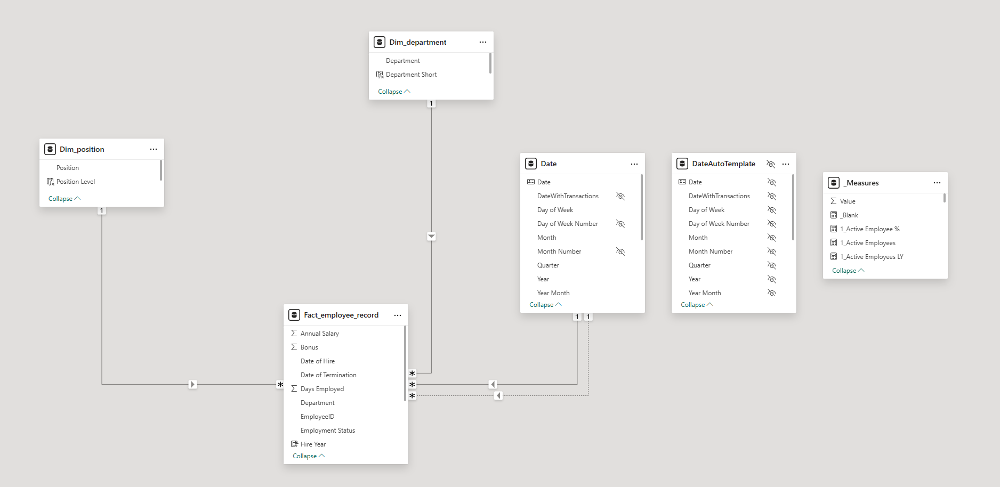
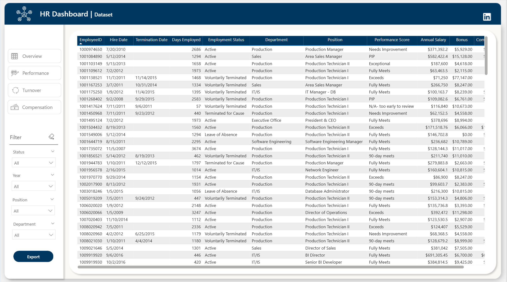
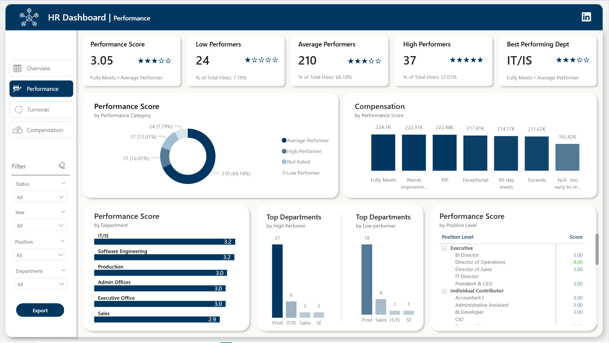
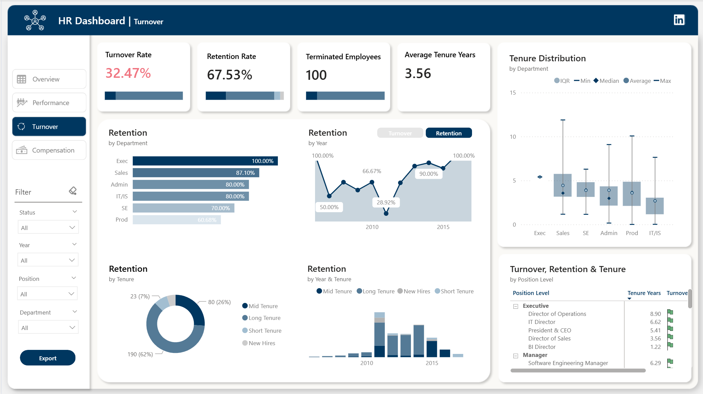
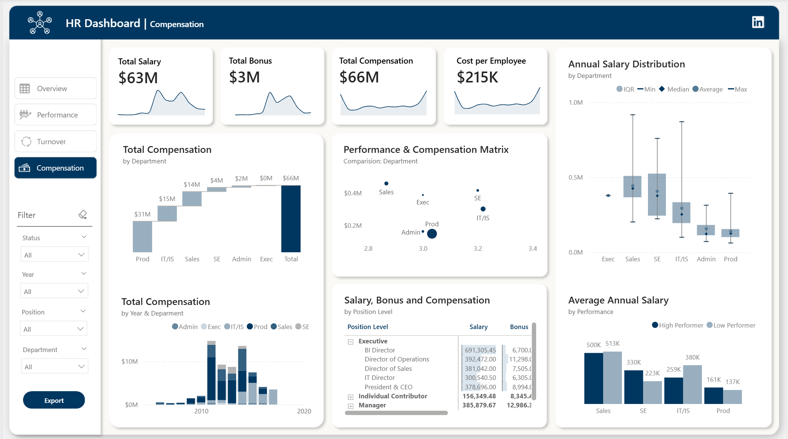
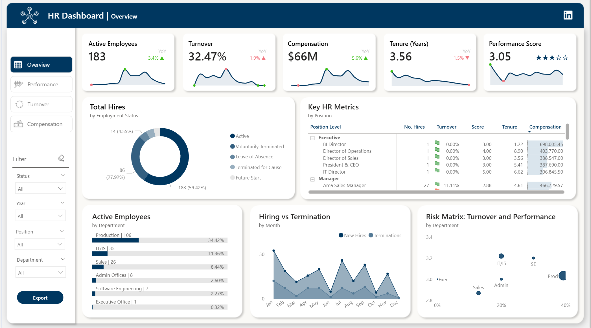

# HR Analytics Dashboard - TechVenture Solutions

A comprehensive Power BI dashboard analyzing workforce metrics, performance, turnover, and compensation patterns to drive strategic HR decisions.

**[📊 View Live Dashboard](https://app.powerbi.com/view?r=eyJrIjoiODY0NGFkNjEtZWZjMy00MGRkLTkzM2YtM2E4NDExOTQxZDdhIiwidCI6ImJlODMyOWE3LTcyMTgtNDlhMy05YWMxLWQ3Yjk1NDU2M2YzOSIsImMiOjEwfQ%3D%3D)** | **[📄 Documentation](./documentation/HR_Analysis.xlsm)**

---

## Table of Contents

1. [Client Background](#client-background)
2. [Executive Summary](#executive-summary)
3. [Dashboard Analysis](#dashboard-analysis)
4. [Key Findings](#key-findings)
5. [Business Recommendations](#business-recommendations)
6. [Methodology](#methodology)
7. [Skills & Tools](#skills--tools)
8. [Next Steps](#next-steps)
9. [Lessons Learned](#lessons-learned)
10. [Contact](#contact)

---

## Client Background

**TechVenture Solutions** is a mid-sized technology company specializing in software development and IT services, operating across multiple departments including Production, IT/IS, Sales, Software Engineering, Admin Offices, and Executive Office. Founded in 2007, the company has grown to over 300 employees across various technical and business functions.

As TechVenture enters its next growth phase, leadership identified the need for data-driven HR insights to address rising turnover concerns, optimize compensation strategies, and improve workforce planning. The company engaged our analytics team to develop a comprehensive HR dashboard that provides actionable insights into employee performance, retention patterns, and compensation effectiveness.

The primary stakeholders include the Chief People Officer, Department Heads, and the Executive Leadership Team, who require regular visibility into workforce metrics to make informed strategic decisions.

---

## Executive Summary

### Questions Answered

This dashboard addresses critical HR questions:

- What is the current state of our workforce composition and performance?
- Which departments face the highest turnover risk?
- How does compensation correlate with performance and retention?
- What performance patterns exist across departments and position levels?
- Where should we focus retention and development efforts?

### Findings at a Glance

- **Active Workforce**: 183 employees (59.42% of total hires)
- **Turnover Rate**: 32.47% with concerning trends in Production department (40% turnover)
- **Performance Distribution**: 68.18% average performers, only 12.01% high performers
- **Compensation**: $66M total compensation with significant variation across departments
- **Retention Challenge**: Average tenure of 3.56 years indicates mid-career attrition
- **Best Performing Department**: IT/IS shows highest performance scores (3.2) with strong retention

### Business Impact

The insights from this dashboard enable TechVenture Solutions to:

- **Reduce turnover costs** by identifying at-risk departments and implementing targeted retention strategies, potentially saving $2-3M annually in replacement costs
- **Optimize compensation budgets** by aligning pay with performance, ensuring top performers are competitively compensated
- **Improve talent development** by identifying skill gaps and training needs across position levels
- **Enhance workforce planning** through predictive insights on hiring needs and succession planning
- **Drive performance improvements** by understanding department-specific challenges and implementing tailored interventions

---

## Dashboard Analysis

### Figure 1: Data Model Architecture

The dashboard is built on a robust star schema data model featuring:

- **Fact Table**: Fact_employee_record (308 records) containing employee transactions and metrics
- **Dimension Tables**: 
  - Dim_department (6 departments)
  - Dim_position (28 positions across multiple levels)
  - Date and DateAutoTemplate for time intelligence
- **Measures Table**: Custom DAX calculations for KPIs and analytics

The model uses proper one-to-many relationships ensuring accurate aggregations and filtering. This architecture enables efficient query performance and maintains data integrity across all dashboard pages.

### Figure 2: Dataset Explorer

The dataset view provides granular employee-level detail with complete employment history including:

- **Employment lifecycle**: Hire dates, termination dates, and employment status tracking
- **Performance metrics**: Individual performance scores ranging from "Needs Improvement" to "Exceptional"
- **Compensation details**: Annual salary, bonus, and total compensation per employee
- **Department and position assignments**: Full organizational structure visibility

This granular data enables drill-through analysis and supports export functionality for detailed reporting needs. The filtering panel allows stakeholders to segment data by status, year, position, and department for targeted analysis.

### Figure 3: Performance Dashboard

The Performance page reveals critical insights about workforce capability:

**Key Performance Indicators**:
- Average performance score of **3.05 (Fully Meets - Average Performer)** indicates room for improvement
- **24 low performers** (7.79% of workforce) require immediate intervention
- **210 average performers** (68.18%) represent the largest segment
- **37 high performers** (12.01%) are critical retention targets
- **IT/IS identified as best performing department** with consistent high scores

**Performance by Department**:
- IT/IS and Software Engineering lead with 3.2 scores
- Production and Admin Offices maintain 3.0 (meeting expectations)
- Sales trails at 2.9, indicating need for performance improvement initiatives

**Compensation vs Performance**:
The matrix shows strong alignment between performance and compensation, with "Fully Meets" and "Exceeds" categories receiving $217K-$224K annually, validating the pay-for-performance model.

**Position Level Analysis**:
Executive positions show varied scores (3.0-4.0), while Individual Contributors cluster around 3.0, suggesting consistent mid-level performance across the organization.

### Figure 4: Turnover Analysis

The Turnover page highlights retention challenges:

**Critical Metrics**:
- **Turnover rate of 32.47%** significantly exceeds industry benchmarks (15-20%)
- **Retention rate of 67.53%** indicates two-thirds of hires remain
- **100 terminated employees** out of 308 total hires
- **Average tenure of 3.56 years** suggests mid-career departure patterns

**Department Retention Rates**:
- Executive Office: **100% retention** (strong C-suite stability)
- Sales and IT/IS: **80% retention** (above company average)
- Production: **60% retention** (critical concern - 40% turnover)

**Retention Trends**:
The year-over-year retention chart shows volatility with a significant dip in 2011 (28.92%) and recovery to 90-100% by 2015, suggesting improved HR practices in recent years.

**Tenure Distribution**:
The box plot reveals Production and IT/IS have the widest tenure ranges, while Executive positions show concentrated mid-range tenure around 5-6 years.

**Tenure Composition**:
- **Long tenure** (26%) and **Mid tenure** (62%) employees form the core workforce
- Only **7% new hires** indicates limited recent recruitment
- Short tenure at **5%** suggests early-stage retention is adequate

### Figure 5: Compensation Strategy

The Compensation page provides insights into pay structures:

**Financial Overview**:
- **Total Salary**: $63M
- **Total Bonus**: $3M (4.8% of salary)
- **Total Compensation**: $66M
- **Cost per Employee**: $215K average

**Compensation by Department**:
- Production carries the highest total compensation burden ($31M) due to headcount
- IT/IS, Sales, and SE range $14-15M each
- Executive and Admin offices maintain lower totals ($2-4M) reflecting smaller teams

**Performance-Based Compensation**:
The scatter plot demonstrates strong correlation between department performance scores (2.8-3.4) and compensation, with IT/IS and Sales showing premium pay aligned with higher performance.

**Salary Distribution by Department**:
- Executive: Highest median salaries ($500K+) with wide distribution
- Sales and SE: Strong middle-tier compensation ($200-550K)
- IT/IS and Admin: Moderate compensation ranges ($150-350K)
- Production: Lower compensation ($100-250K) despite highest headcount

**Compensation by Position Level**:
Executive positions command $300-690K salaries, while Individual Contributors and Managers range $150-385K, showing clear hierarchical pay structures.

**Performance vs Salary**:
High performers in Sales earn significantly more ($513K average) compared to other departments, while low performers across departments earn $137-380K, suggesting opportunities to tighten pay-performance alignment.

### Figure 6: Overview Dashboard

The Overview page serves as the executive summary with integrated KPIs:

**Workforce Health Indicators**:
- **183 active employees** with +3.4% YoY growth (positive hiring trend)
- **Turnover at 32.47%** (+1.9% YoY) shows increasing attrition concern
- **$66M compensation** (+5.6% YoY) reflects competitive pay adjustments
- **3.56 years average tenure** (-1.5% YoY) indicates decreasing retention duration
- **3.05 performance score** with stable trend suggests consistent capability levels

**Hiring Status Breakdown**:
The donut chart shows 183 active employees (59.42%), 86 voluntary terminations (27.92%), 14 involuntary separations (4.55%), with minimal leave of absence and future starts.

**Department Distribution**:
Production dominates with 106 employees (34.42%), followed by IT/IS (35 employees, 11.36%), Sales (26, 8.44%), and smaller support functions. This distribution explains Production's outsized impact on turnover metrics.

**Key HR Metrics Table**:
Position-level analysis reveals:
- Executive positions: Zero turnover, strong performance (3.0-5.0), high compensation ($306-698K)
- Managers (Area Sales): 11.11% turnover, moderate performance (2.88), $466K compensation
- Individual contributors span various metrics requiring segment-specific strategies

**Hiring vs Termination Trends**:
The monthly trend line shows hiring peaked in early 2010s with subsequent decline, while terminations remain relatively steady, contributing to net workforce reduction over time.

**Risk Matrix**:
The scatter plot identifies departments at risk:
- Production: High turnover (~40%), moderate performance (3.0) - highest risk quadrant
- Sales: Moderate turnover (~20%), low performance (2.8) - performance improvement needed
- IT/IS and SE: Low turnover (~10-15%), high performance (3.2) - healthy status
- Admin and Executive: Optimal quadrant with low turnover and solid performance

---

## Key Findings

The analysis reveals **three critical workforce challenges** that require immediate attention. First, the **32.47% turnover rate** far exceeds industry standards, with the **Production department experiencing 40% attrition**, representing the highest organizational risk. This department alone accounts for 34% of the workforce, making its instability particularly concerning.

Second, **performance distribution skews heavily toward average**, with 68% of employees in the "Fully Meets" category and only 12% achieving high performance status. This suggests **limited excellence** and potential **development gaps** across the organization. The Sales department's **2.9 performance score** (lowest among all departments) combined with moderate turnover signals an **underperforming unit** requiring intervention.

Third, while **compensation appears aligned with performance** at the macro level ($66M total with clear pay-for-performance structure), there are notable **retention challenges despite competitive pay**. The **average tenure of 3.56 years** indicates employees are leaving during their **mid-career development phase**, suggesting factors beyond compensation (career growth, management, culture) may be driving departures.

On the positive side, **IT/IS emerges as a model department** with the **highest performance score (3.2)**, **strong retention (80%)**, and engaged workforce. The **Executive Office maintains 100% retention**, demonstrating **leadership stability**. These successes provide **blueprints for organizational improvement**.

---

## Business Recommendations

**Immediate Priority: Production Department Intervention** - Launch a **comprehensive retention program** for the Production department within the next 90 days. This should include **stay interviews** with current employees, **exit interview analysis** to identify root causes of the 40% turnover, and implementation of **targeted improvements** such as enhanced training, career pathing, and management development. Consider conducting an **organizational health assessment** specifically for Production leadership and workflow processes.

**Performance Development Initiative** - Develop a **structured performance improvement plan** targeting the 68% of employees in the average performer category. Implement **clear advancement criteria**, **skills development programs**, and **regular performance coaching** to shift more employees into the high performer category. For the Sales department specifically, introduce **sales enablement training**, **revised incentive structures**, and potentially **new leadership** to address the 2.9 performance score.

**Strategic Compensation Refinement** - While overall compensation is competitive, conduct a **detailed pay equity analysis** to ensure high performers are appropriately rewarded and **retention-critical positions** receive market premiums. Consider introducing **tenure bonuses** or **milestone rewards** to address the mid-career attrition pattern. For Production employees, evaluate if **compensation adequacy** contributes to turnover alongside other factors.

**Retention Risk Monitoring** - Implement a **predictive attrition model** using the dashboard metrics to identify at-risk employees before they resign. Focus on employees with **3-4 years tenure** (peak departure window), those in **Production and Sales**, and any **high performers with compensation below market**. Establish **quarterly retention reviews** with department heads to proactively address emerging risks.

**Best Practice Replication** - Study the **IT/IS department's success factors** (3.2 performance, 80% retention) and **Executive Office stability** to identify transferable practices. This may include **management approaches**, **team structures**, **development opportunities**, or **culture elements** that can be adapted for other departments, particularly Production and Sales.

---

## Methodology

**Data Collection & Preparation**:
- Employee data extracted from HRIS system covering 308 employees with complete employment history
- Datasets include fact table (employee records) and dimension tables (departments, positions)
- Data cleaning performed to handle termination dates, employment status, and ensure referential integrity

**Dashboard Development**:
- Power BI used as primary visualization and analytics platform
- Star schema data model implemented for optimal performance and user experience
- Custom DAX measures created for complex KPIs including turnover rates, tenure calculations, and performance scoring
- Five dashboard pages developed: Overview, Performance, Turnover, Compensation, and Dataset explorer

**Analysis Approach**:
- Descriptive analytics to understand current workforce state
- Comparative analysis across departments, positions, and time periods
- Correlation analysis between performance, compensation, and retention metrics
- Risk segmentation to identify high-priority intervention areas

---

## Skills & Tools

**Technical Skills**:
- Power BI Desktop (data modeling, DAX, visualizations)
- Data cleaning and transformation (Power Query)
- Statistical analysis and business intelligence
- Dashboard design and UX principles

**Analytical Skills**:
- HR metrics and workforce analytics
- Performance management systems
- Compensation analysis
- Turnover and retention analytics

**Business Skills**:
- Stakeholder communication
- Strategic HR planning
- Data storytelling
- Business requirements gathering

---

## Next Steps

1. **Deploy Dashboard to Production** - Publish the Power BI report to the organization's workspace with appropriate security and refresh schedules
2. **Conduct Stakeholder Training** - Host workshops with HR team and department heads on dashboard navigation and insight interpretation
3. **Implement Automated Alerting** - Set up Power BI alerts for critical thresholds (e.g., department turnover exceeding 35%)
4. **Expand Data Sources** - Integrate additional data such as employee engagement surveys, recruitment metrics, and learning & development records
5. **Develop Predictive Models** - Build machine learning models to forecast attrition risk at the individual employee level
6. **Create Department Scorecards** - Develop detailed sub-dashboards for each major department with customized metrics
7. **Establish Monthly Review Cadence** - Schedule recurring meetings with leadership to review metrics and track improvement initiatives

---

## Lessons Learned

Building this HR dashboard reinforced the importance of balancing technical precision with business storytelling. Initially, I focused heavily on the data model and DAX calculations, but realized that stakeholders needed clear narrative context to translate metrics into action. The most valuable feedback came from simplifying performance visualizations and adding the risk matrix, which immediately resonated with executives who could quickly identify problem areas.

One challenge was deciding the right level of granularity. While the dataset view provides individual employee details, most strategic decisions happen at the department and position level. Finding that balance between detail and aggregation required several iterations with stakeholders. I learned that different audiences need different views, hence the multi-page approach worked well.

The project also highlighted how interconnected HR metrics are. You cannot analyze turnover without understanding performance and compensation context. This reinforced the value of integrated dashboards over isolated reports. If I were starting over, I would invest more time upfront in stakeholder interviews to understand their decision-making workflows, which would have streamlined the design phase.

Finally, I underestimated the change management aspect. A dashboard is only valuable if people use it and trust the data. Building that credibility required transparent documentation of data sources, calculation methods, and limitations. This README itself is part of that transparency effort, ensuring anyone can understand how insights were derived and what actions they should inform.

---

## Contact

**Tien Huynh**

   

---

*This project demonstrates end-to-end HR analytics capabilities including data modeling, advanced DAX calculations, dashboard design, and strategic business insights. The analysis transforms raw employee data into actionable intelligence for workforce planning and talent management.*
